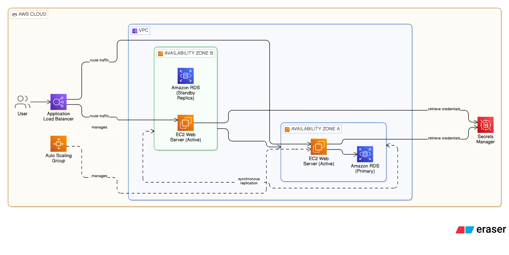

# AWS Well-Architected and Cloud Adoption Assessment Report

This report evaluates the migration of a two-tier web application from on-premises servers to AWS, ensuring alignment with cloud best practices.

---
## Task 1: Review the Existing Architecture

Based on the provided lab background, I have identified the following components and risks for the current on-premises workload:

### Workload Components
* **Frontend:** A web application layer handling user interface and initial requests.
* **Backend:** A database layer responsible for data storage and management.

### Potential Risks or Weaknesses
* **Single-AZ Deployment:** The architecture lacks high availability, meaning a single failure could lead to total downtime.
* **No Backup Strategy:** There is no documented plan for data recovery or redundancy in case of failure.
* **Open Security Groups:** The current firewall settings are too permissive, increasing the potential attack surface.
* **On-Premises Constraints:** Migrating from physical servers requires addressing inherent limitations in scalability and manual management.

---

## Task 2: AWS Well-Architected Framework (WAF) Assessment

The following table evaluates the workload against the five WAF pillars to identify strengths and areas for improvement.

| Pillar | Strength | Area for Improvement | Supporting AWS Service |
| --- | --- | --- | --- |
| **Operational Excellence** | Basic understanding of application components is present. | Manual deployment processes lead to high human error rates. | **AWS CloudFormation** |
| **Security** | Logical separation of frontend and backend exists. | Open security groups and lack of encryption increase the attack surface. | **AWS IAM & Security Groups** |
| **Reliability** | The workload is currently functional on-premises. | Single-AZ deployment creates a single point of failure with no backup strategy. | **Amazon RDS (Multi-AZ)** |
| **Performance Efficiency** | Serves existing user base on dedicated hardware. | Fixed on-premises hardware cannot scale dynamically to meet demand. | **Amazon EC2 Auto Scaling** |
| **Cost Optimization** | No variable cloud costs in the current state. | Paying for "always-on" idle hardware regardless of actual traffic. | **AWS Cost Explorer** |

---

## Task 3: AWS Cloud Adoption Framework (CAF) Summary

The following analysis evaluates organizational readiness across the six CAF perspectives.

### 1. Business Perspective

The organization must align its IT investment with business outcomes by transitioning from a fixed Capital Expenditure (CapEx) model to a variable Operational Expenditure (OpEx) model. Readiness involves developing a clear business case for migration that highlights increased agility and reduced time-to-market. Key enablers include establishing a cloud steering committee to ensure the migration supports broader organizational goals and KPIs.

### 2. People Perspective

Successful migration requires a shift in workforce skills and organizational culture. Currently, the team is accustomed to physical server management and must be upskilled in cloud-native concepts like automated provisioning. Actions needed include creating a formal training plan for developers and administrators to bridge the "cloud skills gap." Fostering a culture of continuous learning and experimentation is essential for long-term cloud success.

### 3. Governance Perspective

Governance in the cloud requires dynamic, automated guardrails rather than static manual approvals. The organization needs to implement automated cost-tracking and compliance-monitoring tools. A key enabler is the use of **AWS Organizations** to manage multiple accounts and **Service Control Policies (SCPs)** to enforce organizational standards across all AWS resources, ensuring financial and regulatory oversight.

### 4. Platform Perspective

Readiness for the Platform perspective involves moving from monolithic, manual server configurations to standardized, automated infrastructure. The current two-tier architecture should be modernized using managed services to reduce administrative overhead. A primary action is the adoption of "Landing Zones" to provide a consistent environment for all workloads, along with **Amazon RDS** to automate database lifecycle management.

### 5. Security Perspective

Cloud security readiness requires a "defense-in-depth" approach that protects every layer of the architecture. The organization must move away from simple perimeter firewalls toward identity-centric security. Key enablers include implementing **AWS Identity and Access Management (IAM)** with the principle of least privilege, and utilizing **AWS KMS** for centralized encryption management to ensure data remains secure in transit and at rest.

### 6. Operations Perspective

The shift to cloud operations requires adopting a "you build it, you run it" mindset and automating as many operational tasks as possible. Currently, the organization lacks comprehensive monitoring and incident response for cloud environments. To enable readiness, the team must implement **Amazon CloudWatch** for real-time observability and establish automated incident response playbooks to maintain high availability.

---

## Task 4: Improved Architecture Design

### Revised Architecture Description

My proposed AWS architecture eliminates the weaknesses of the on-premises setup by introducing high availability and automation.

* **Networking**: A Virtual Private Cloud (VPC) spanning two Availability Zones (AZs).
* **Edge/Frontend**: An **Application Load Balancer (ALB)** distributes traffic to web servers in an **Auto Scaling Group** across both AZs.
* **Compute**: Web servers reside in private subnets, only accessible via the ALB.
* **Database**: The backend is migrated to **Amazon RDS (Multi-AZ)**, ensuring synchronous data replication and automatic failover across AZs.
* **Security**: Minimalist Security Groups allow traffic only on required ports (e.g., 443 for web, 5432 for DB), and **AWS Secrets Manager** is used for database credentials.

 

---

## Reflection

Completing this assessment highlighted that moving to the cloud is as much about organizational readiness (CAF) as it is about technical design (WAF). I learned that a "lift-and-shift" approach without applying the five pillars leaves critical risks, such as single-AZ failures, unaddressed. By structured reasoning through the CAF perspectives, I now understand that technical teams need clear governance and business alignment to sustain cloud growth effectively.